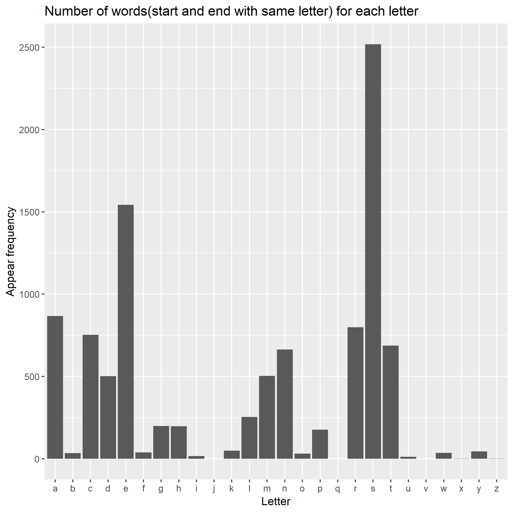

---
output:
  md_document:
    variant: markdown_github
    toc: true
---

# Homework 9: Automating Data-analysis Pipelines
The aim of hw-09 is to modify the make activity pipeline.
To emphasize, this whole work is based on Jenny's [make-activity repo](https://github.com/STAT545-UBC/make-activity), which is the original repo and all modification about pipelines are based on this.

## Requirements
  * Add one R script and one Rmd script, and add them to the make pipeline by modifying the Makefile.
  * The output should at least be a document (like html, pdf)
  * Additions need to be tied to the existing pipeline
  * Additions should correspond to some analysis
  
## Makefile requirements
  * If a dependency changes, running make should update the appropriate output 
  * Running make all should result in having all output presenT
  * Running make clean should remove all output
  * There shouldn’t be any useless output, such as an Rplots.pdf file
  
  
  
## Implemented automation

  * R script file: generate two files(samechar.csv, number.tsv)
   				samechar.csv contains all words which start and end with the same letter
   				number.tsv counts the number of samechar words for each letter
   				
  * Rmd file: apart from the original report.rmd, here generate a lettercount.rmd to indicate the information 
  						based on words sorting
  
  * Results:
  
  
  
  
## Content

|Content | Link  |
|--------|---------|
|Readme file of Homework 9 | [Readme](https://github.com/STAT545-UBC-students/hw08-chenchenguo/blob/master/README.md)|
|Source code | [Makefile](https://github.com/STAT545-UBC-students/hw08-chenchenguo/blob/master/bcl/app.R)|
|Rest files | [files](https://github.com/STAT545-UBC-students/hw08-chenchenguo/tree/master/bcl)|

  
  

## References
- [Assignment page](http://stat545.com/Classroom/assignments/hw09/hw09.html)
- [Automation](http://stat545.com/Classroom/notes/cm109.nb.html)
- [Jenny's tutorial](http://stat545.com/automation04_make-activity.html)
  
Thank you.

  